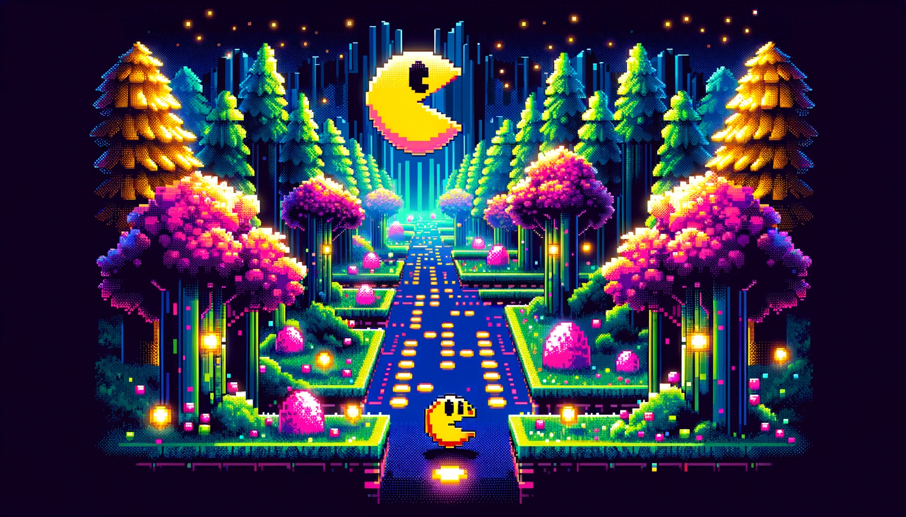

# Pacman AI with RandomForest Classifier

This repository contains a modified approach to the classic Pacman game, utilizing a RandomForest classifier for decision-making. The classifier is trained on good moves generated by the TraceAgent and utilizes game state information provided by the `api.py`. This project aims to explore machine learning techniques in game strategy development, offering a unique take on navigating Pacman through various mazes.



## Licensing Information

This project is built upon the Pacman AI projects from UC Berkeley (http://ai.berkeley.edu/). The code modifications for the RandomForest classifier and training procedures are added by third parties.

You are free to use or extend these projects for educational purposes provided that:

1. You do not distribute or publish solutions to the original problems and test cases the code was designed for.
2. You retain this notice.
3. You provide clear attribution to UC Berkeley, including a link to http://ai.berkeley.edu. Download their codebase.
The core projects and autograders were primarily created by John DeNero (denero@cs.berkeley.edu) and Dan Klein (klein@cs.berkeley.edu). The RandomForest implementation and integration with the Pacman AI are contributions from third parties.

## Getting Started

To run the modified Pacman game with the RandomForest classifier, you will need Python 2.7 or higher. No additional machine learning libraries are required as the RandomForest algorithm is implemented from scratch for educational purposes.

### Running the Agent

You can run the agent in various modes and mazes. Here are some commands to get you started:

- Run Pacman in the default mode:
    ```bash
    python pacman.py
    ```

- Run Pacman with the RandomForest agent in a large maze:
    ```bash
    python pacman.py --layout largeMaze --pacman ClassifierAgent
    ```

- Run Pacman with the RandomForest agent in a hard maze:
    ```bash
    python pacman.py --layout hardMaze --pacman ClassifierAgent
    ```

For additional commands and options, refer to the `commands.txt` file or use the `-h` flag to get help:

```bash
python pacman.py -h
```

### Training the Classifier

The RandomForest classifier is trained on moves generated by the TraceAgent. The training data is stored in `good-moves.txt`, which represents good moves in various game states as observed by the TraceAgent. The classifier learns to predict the best move based on the current game state provided by `api.py`.

### Documentation

- `api.py`: Provides a simplified interface for the Pacman game state, facilitating the extraction of features for the RandomForest classifier.
- `commands.txt`: Contains various command-line commands to run the Pacman game with different agents and mazes.

## Contribution

Contributions to the project are welcome. If you have improvements or bug fixes, please feel free to fork the repository and submit a pull request. Ensure that any contributions adhere to the licensing agreements of the Pacman AI projects from UC Berkeley.

## Acknowledgements

This project is based on the Pacman AI projects developed at UC Berkeley. Special thanks to John DeNero, Dan Klein, and the UC Berkeley team for creating the original Pacman AI projects. The RandomForest classifier integration is made possible thanks to contributions from third-party developers interested in exploring AI in games.
